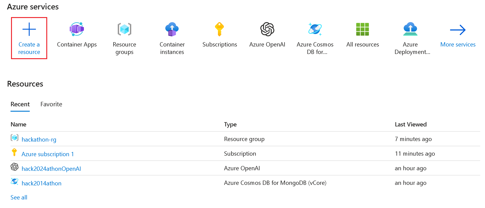

# Cosmos DB Dev Guide Backend App - Node.js

* https://github.com/AzureCosmosDB/Azure-OpenAI-Node.js-Developer-Guide/tree/main/11_Backend_API
* https://github.com/AzureCosmosDB/Azure-OpenAI-Node.js-Developer-Guide/blob/main/Labs/backend_api/README.md
* https://github.com/AzureCosmosDB/Azure-OpenAI-Node.js-Developer-Guide/tree/main/Backend

## Azure container registry
https://learn.microsoft.com/en-us/azure/container-registry/container-registry-get-started-portal?tabs=azure-cli

